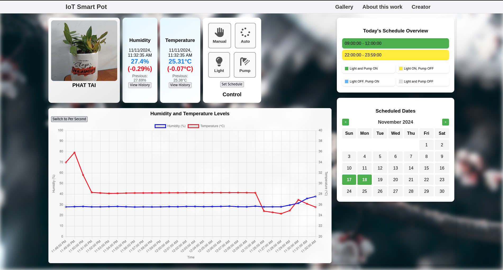
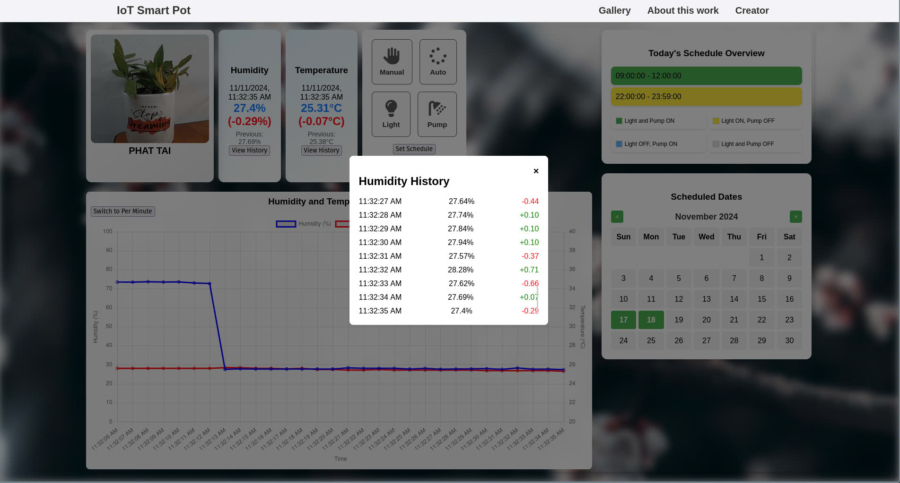
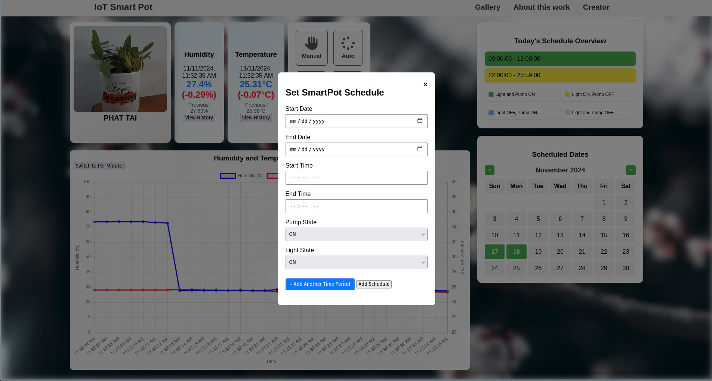
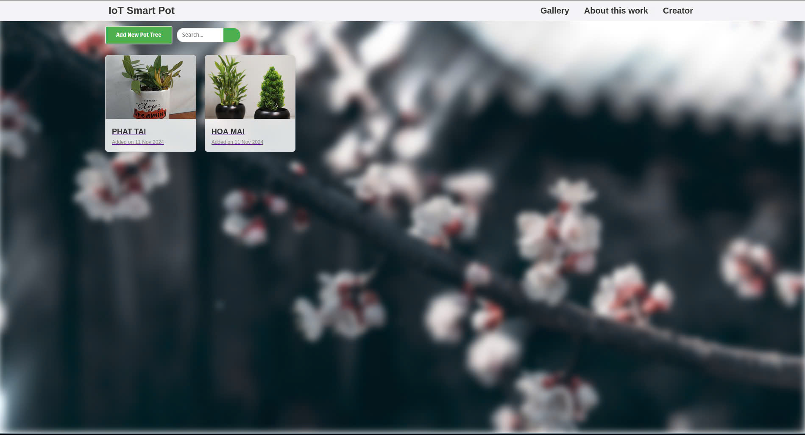

# 🌿 SmartPod – IoT Smart Plant System

SmartPod is an IoT-based system that lets you monitor and control your plants using ESP32, MQTT, and a custom dashboard. It supports real-time temperature and humidity tracking, manual/automatic control of pumps and lights, and scheduling via a user interface.

---

## 🖼️ System Overview

---

## 🌐 Web Interface

### 🌱 Main Dashboard

Shows plant status, sensor readings, control buttons, and real-time charts.

---

### 📈 Humidity History Popup

Shows second-by-second humidity changes.

---

### 🗓️ Schedule Setup

Set custom watering and lighting schedules.

---

### 🪴 Pod Gallery

Manage and view all plant pods.

---

## ⚙️ Built With

- ESP32 + Sensors + Actuators
- MQTT (Mosquitto)
- HTML/CSS/JavaScript
- Java (for chart rendering)

---

## 👤 Author

**Lê Quốc Thịnh**  
[github.com/ThinhQuocLe007](https://github.com/ThinhQuocLe007)
